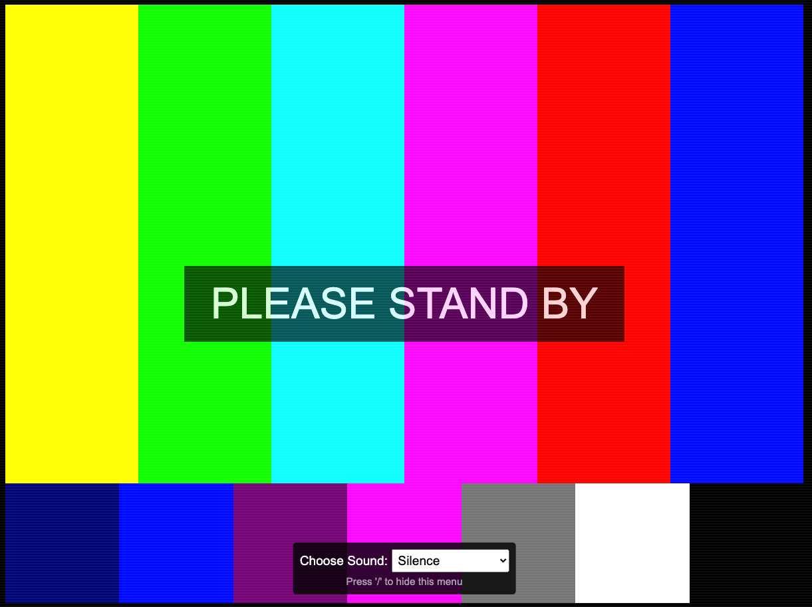

# TV Test Pattern - "Please Stand By"

## Remember When TVs Actually Went "Off the Air"?

Hey, remember when TVs actually went "off the air" and stopped broadcasting? If you're old enough, you might recall the days when, instead of endless late-night infomercials or streaming content, TV stations would literally sign off for the night. When the broadcast day ended, the programming would stop, and viewers were left with a test pattern and a droning tone or static. This "Please Stand By" moment was a staple of late-night television, signaling that it was time to head to bed.

Demo URL: https://eric-blue.com/please-stand-by/

### A Brief History of the TV Test Signal

The TV test pattern, also known as the test card, has a fascinating history. It was introduced in the early days of television as a way for engineers and technicians to calibrate the equipment and ensure the broadcast signal was being transmitted correctly. The most iconic test pattern in the United States was the RCA Indian Head Test Pattern, introduced in 1939. This pattern featured a Native American chief in a headdress, surrounded by geometric shapes, circles, and lines used to calibrate the television's display.

**Fun Facts:**

- **Indian Head Test Pattern:** This was the most recognized test pattern in the U.S. and was used from 1940 until the late 1970s.
- **Purpose:** The test pattern helped technicians adjust contrast, brightness, linearity, and focus on their TV sets. It also provided a way to align the audio and visual signals.
- **Off-Air Sign-Offs:** Before the test pattern appeared, stations would often play the national anthem, followed by a sign-off message. Then, the test pattern would take over until the next morning's broadcast began.
- **Continuous Tone or Static:** The most common audio accompanying the test pattern was either a continuous tone (around 1 kHz) or white noise (static), both of which served to keep the audio signal alive and ready for the next broadcast.

### About This Tiny Project

This simple html page is a modern recreation of that nostalgic TV test pattern, complete with some added fun and interactive features. You can toggle between different types of audio effects and even simulate the experience of a bad signal with a flickering screen and static noise.

This was also created VERY quickly - in about 10-15 mins - mostly as a test to see the latest code generation and image recognition capabilities of OpenAI's gpt-4o-mini and gpt vision.  I uploaded some sample test pattern images and brainstormed on a few different visual and audio effects.  I settled on this basic test pattern.  How is this useful?  Make this your new 404 page, or put this on before bed as a reminder to go offline 🙂

#### Available Audio Types:

- **Silence:** Sometimes, the test pattern appeared with no sound at all, just a silent, unmoving image.
- **Continuous Tone:** A steady, high-pitched tone, commonly around 1 kHz, was often played to maintain the audio signal.
- **White Noise:** The sound of static, like the hiss of an untuned radio, was another common accompaniment.
- **National Anthem:** Before the test pattern appeared, some stations would play the national anthem, making this a more nostalgic option.

#### Toggle the Audio Menu:

- You can toggle the audio menu visibility by pressing the `/` key on your keyboard. This allows you to switch between audio effects or simply turn off the sound altogether.

## Author

Created by Eric Blue ([https://eric-blue.com](https://eric-blue.com/))

